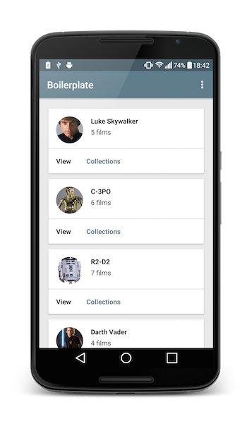

Android Boilerplate 
===================

    

A simple boilerplate application which demonstrates the downloading, persisting and syncing of data - displayed with a common layout used amongst applications. It features the use of the Design Support library, data caching and the new Test Modules, separating the functional tests from production code.

The project is setup using:

- Functional test Module with [Espresso](https://code.google.com/p/android-test-kit/wiki/Espresso)
- Unit tests with [Robolectric](http://robolectric.org/) 
- [RxJava](https://github.com/ReactiveX/RxJava) and [RxAndroid](https://github.com/ReactiveX/RxAndroid) 
- [Retrofit](http://square.github.io/retrofit/) and [OkHttp](https://github.com/square/okhttp)
- [Dagger 2](http://google.github.io/dagger/)
- [SqlBrite](https://github.com/square/sqlbrite)
- [EasyAdapter](https://github.com/ribot/easy-adapter)
- [Butterknife](https://github.com/JakeWharton/butterknife)
- [Timber] (https://github.com/JakeWharton/timber)
- [Mockito](http://mockito.org/)
- [Glide](https://github.com/bumptech/glide)

    

Requirements
------------

 - [Android SDK](http://developer.android.com/sdk/index.html).
 - Android [5.1 (API 22) ](http://developer.android.com/tools/revisions/platforms.html#5.1).
 - Android SDK Tools
 - Android SDK Build tools 23.0.0.0 rc3
 - Android Support Repository
 - Android Support library

Building
--------

To build, install and run a debug version, run this from the root of the project:

    ./gradlew installRunDebug
    
Testing
--------

For Android Studio to use syntax highlighting for Automated tests and Unit tests you **must** switch the Build Variant to the desired mode.

To run **unit** tests on your machine using [Robolectric] (http://robolectric.org/):

    ./gradlew testDebug
    
To run **automated** tests on connected devices:

    ./gradlew connectedAndroidTest

Thanks
--------

Thanks to the following for contributions!

[ivacf] (https://github.com/ivacf)  
[Jawnnypoo] (https://github.com/Jawnnypoo)

Attributions
------------

Thanks to the following for use of icons off of Noun Project:

[Iconoci](https://thenounproject.com/iconoci)
