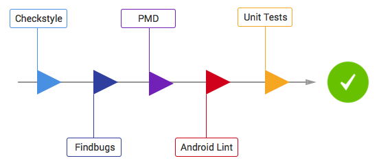

# Android Boilerplate

Sample Android app that we use at [ribot](http://ribot.co.uk) as a reference for new Android projects. It demonstrates the architecture, tools and guidelines that we use when developing for the Android platform (https://github.com/ribot/android-guidelines)

Libraries and tools included:

- Support library 22.2
- RecyclerViews and CardViews 
- [RxJava](https://github.com/ReactiveX/RxJava) and [RxAndroid](https://github.com/ReactiveX/RxAndroid) 
- [Retrofit](http://square.github.io/retrofit/) and [OkHttp](https://github.com/square/okhttp)
- [Dagger 2](http://google.github.io/dagger/)
- [SqlBrite](https://github.com/square/sqlbrite)
- [EasyAdapter](https://github.com/ribot/easy-adapter)
- [Butterknife](https://github.com/JakeWharton/butterknife)
- [Picasso](http://square.github.io/picasso/)
- [Otto](http://square.github.io/otto/) event bus
- Functional tests with [Espresso](https://code.google.com/p/android-test-kit/wiki/Espresso)
- Unit tests with [Robolectric](http://robolectric.org/) 
- [Mockito](http://mockito.org/)
- [Checkstyle](http://checkstyle.sourceforge.net/), [PMD](https://pmd.github.io/) and [Findbugs](http://findbugs.sourceforge.net/) for code analysis

## Requirements

- [Android SDK](http://developer.android.com/sdk/index.html).
- Android [5.1 (API 22) ](http://developer.android.com/tools/revisions/platforms.html#5.1).
- Android SDK Tools
- Android SDK Build tools 22.0.1 
- Android Support Repository

## Architecture

This project follows our Android architecture guidelines. Read more about them [here](https://github.com/ribot/android-guidelines/blob/master/architecture_guidelines/android_architecture.md). 


## Code Quality

This project integrates a combination of unit tests, functional test and code analysis tools. 

### Tests

To run **unit** tests on your machine:

``` 
./gradlew test
``` 

To run **functional** tests on connected devices:

``` 
./gradlew connectedAndroidTest
``` 

Note: For Android Studio to use syntax highlighting for Automated tests and Unit tests you **must** switch the Build Variant to the desired mode.

### Code Analysis tools 

The following code analysis tools are set up on this project:

* [PMD](https://pmd.github.io/): It finds common programming flaws like unused variables, empty catch blocks, unnecessary object creation, and so forth. See [this project's PMD ruleset](config/quality/pmd/pmd-ruleset.xml).

``` 
./gradlew pmd
```

* [Findbugs](http://findbugs.sourceforge.net/): This tool uses static analysis to find bugs in Java code. Unlike PMD, it uses compiled Java bytecode instead of source code.

```
./gradlew findbugs
```

* [Checkstyle](http://checkstyle.sourceforge.net/): It ensures that the code style follows [our Android code guidelines](https://github.com/ribot/android-guidelines/blob/master/project_and_code_guidelines.md#2-code-guidelines). See our [checkstyle config file](config/quality/checkstyle/checkstyle-config.xml).

```
./gradlew checkstyle
```

### The check task

To ensure that your code is valid and stable use check: 

```
./gradlew check
```

This will run all the code analysis tools and unit tests in the following order:


 
## Distribution

The project can be distributed using either [Crashlytics](http://support.crashlytics.com/knowledgebase/articles/388925-beta-distributions-with-gradle) or the [Google Play Store](https://github.com/Triple-T/gradle-play-publisher).

To do this, set up a local variable `$ANDROID_DISTRIBUTION` to any of the following values:

    play-production
    play-alpha
    play-beta
    crashlytics-yourgroupname
    crashlytics-yourgroupname2

    etc

Then use the following command e.g. on your CI server:

    ./gradlew clean check connectedAndroidTest assembleRelease $(if [[ $ANDROID_DISTRIBUTION == crashlytics-* ]]; then echo crashlyticsUploadDistributionRelease; else echo publishApkRelease; fi )

## New project setup 

To quickly start a new project from this boilerplate follow the next steps:

* Download this [repository as a zip](https://github.com/ribot/android-boilerplate/archive/master.zip).
* Change the package name. 
  * Rename packages in main, androidTest and test using Android Studio.
  * In `app/build.gradle` file, `packageName` and `testInstrumentationRunner`.
  * In `src/main/AndroidManifest.xml` and `src/debug/AndroidManifest.xml`.
* Optionally, in `app/build.gradle` add the signing config to enable release versions.
* Optionally, replace Crashlytics API key in AndroidManifest.xml and uncomment Crashlytics lines in `AndroidBoilerplateApplication.java` and `app/build.gradle`
* Create a new git repository, [see GitHub tutorial](https://help.github.com/articles/adding-an-existing-project-to-github-using-the-command-line/).
* Replace the example code with your app code following the same architecture.
* Update `proguard-rules.pro` to keep models (see TODO in file) and add extra rules to file if needed.
* Update README with information relevant to the new project.
